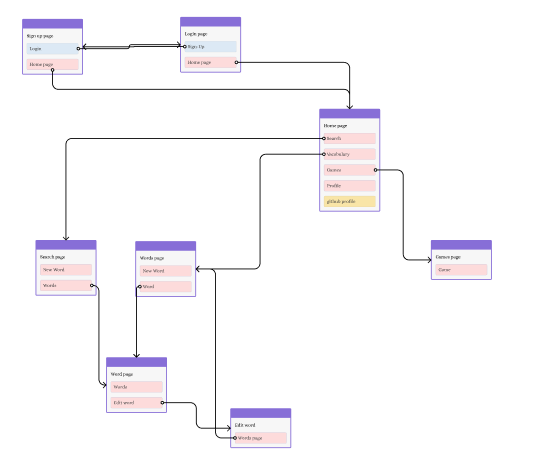

# @lp/front — Frontend for Language Power

This is the frontend web application for **Language Power**, developed within the lp monorepo.  
It’s the primary user-facing client, built with React, TypeScript, and integrated with the shared `@lp/ui` design system.

## Live Demo: [View Deployed Project](https://lp-monorepo-1.onrender.com)

## Background

Language Power is an advanced learning platform, originally built for English learners ([see previous version here](https://github.com/marusyaganza/language-power)).  
This iteration delivers improved UI, new learning games, and seamless design system integration, making it ideal for both learning and showcasing modern frontend workflows.

---

## Project Structure

This app lives in the monorepo alongside:

- `@lp/ui`: The shared UI component library and design system
- `@lp/server`: Apollo server

You can see the designs for major pages and flows in **Figma**:  
[View project page designs in Figma](https://www.figma.com/design/uLznHs3pU0bQqy7Wwn3xQx/Design-system?node-id=2-228&t=cV9Um1WVsmJJoaFu-1)

---

## API & Data Layer

- **Apollo Client:** The front package relies on Apollo Client to interact with the GraphQL backend efficiently and with automatic caching and real-time updates.
- **TypeScript Type Generation:** Before running or building the app, TypeScript types for all GraphQL queries, mutations, and fragments are generated via the shared schema. Run `yarn codegen` at the repo root to update types after backend/schema changes.

This approach keeps the frontend strictly typed and connected to the backend structure—minimizing bugs and improving developer experience.

## Getting Started

#### 1. Clone the Monorepo

```bash
git clone https://github.com/marusyaganza/lp-monorepo.git
cd lp-monorepo
```

#### 2. Install Dependencies

From the root of the monorepo:

```bash
yarn
```

#### 3. Start the Project

```bash
yarn codegen
yarn start
```

This runs the app in development mode locally.  
The frontend will use the shared UI components from `@lp/ui` and fetch dictionary/game data from `@lp-server`.

---

## Features

- **User Registration & Login**
- **Vocabulary Management:** Search for words, add to your list, delete, and view word details
- **Learning Games:** Six interactive games for mastering your vocabulary
- **Progress Tracking:** Words are marked “learned” after repeated successful training

The full sitemap for these pages and flows:.



---

## Design System

All pages and interface elements are designed with reusability and accessibility in mind via the `@lp/ui` component set.

---

## Scripts

You can find common development scripts in `package.json`:

- `yarn start` — Starts the development server
- `yarn prod` — Production build (Webpack)
- `yarn cypress` — Run end-to-end tests interactively
- `yarn lint` / `yarn stylelint` — Code and style checking
- `yarn codegen` — Generates TypeScript types from the project GraphQL schema

For advanced usage, see `package.json` for details.
